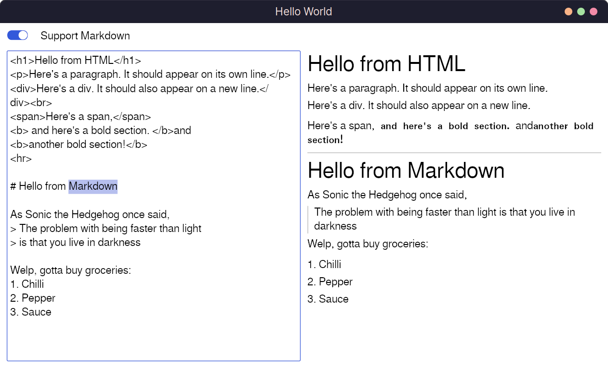

# frostmark

*HTML/Markdown viewer for iced*



# How to use it?

1. Create a `MarkState` and **store it in your application state**.

```rust
MarkState::with_html_and_markdown(YOUR_TEXT)
// or if you just want HTML
MarkState::with_html(YOUR_TEXT)
```

2. In your `view` function use a `MarkWidget`.

```rust
widget::container( // just an example
    MarkWidget::new(&self.mark_state)
        // The below methods are optional
        .font_bold(Font {
            weight: iced::font::Weight::ExtraBold,
            ..Default::default()
        })
        .font_mono(Font::MONOSPACE)
        .on_copying_text(|_| Message::Nothing),
)
.padding(10)
```

# Example

You can find examples in the `examples/` directory.

<details>
<summary>Here's a simple example:</summary>

```rust
use frostmark::{MarkState, MarkWidget};
use iced::{widget, Element, Font, Task};

#[derive(Debug, Clone)]
enum Message {
    Nothing,
}

struct App {
    state: MarkState,
}

impl App {
    fn update(&mut self, message: Message) -> Task<Message> {
        match message {
            Message::Nothing => {}
        }
        Task::none()
    }

    fn view(&self) -> Element<'_, Message> {
        widget::container(
            MarkWidget::new(&self.state)
                .font_bold(Font {
                    weight: iced::font::Weight::ExtraBold,
                    ..Default::default()
                })
                // There are other methods to
                // set up mono fonts, links, images,
                // and text copying
        )
        .padding(10)
        .into()
    }
}

fn main() {
    iced::application("Hello World", App::update, App::view)
        .run_with(|| {
            (
                App {
                    state: MarkState::with_html_and_markdown(YOUR_TEXT),
                },
                Task::none(),
            )
        })
        .unwrap();
}

const YOUR_TEXT: &str = "Some *Markdown* or <b>HTML</b> text here!";
```

</details>
<br>

# How does this work

- Markdown (if present) is converted to HTML using `comrak`.
- HTML is parsed using `html5ever`, a component of the [Servo browser](https://servo.org/) project.
- The resulting DOM is then converted **directly** to `iced` widgets by our custom renderer.

The main highlight here is that we don't use any custom widgets.
This entire thing renders to a tree of `column`/`row`
containing `rich_text`, `button`, `horizontal_bar`/`vertical_bar` and so on.

If you're curious, the actual rendering happens directly
inside the `impl Into<Element> for MarkWidget`!

# TODO

- [ ] Add more examples for things like images, links, and text copying.
- [ ] Improve the ability for users to style `MarkWidget` text, buttons, etc.
- [ ] Have a "quick and dirty" function that takes in text and just renders it in one go (cached, of course).
- [ ] Add support for more elements like underline, strikethrough, superscript, subscript, etc.
- [ ] Add GIF support.
